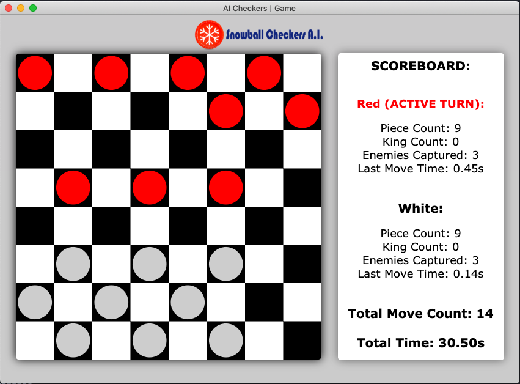

# Snowball
An Artificially Intelligent Checkers player that implements evolutionary learning, minimax searching, and alpha-beta pruning techniques.

____

Developer Dependencies:

  - node.js
  - node package manager
  - electron

Example frontend build setup:

```
$ brew install node (apt-get install nodejs on linux)
$ npm install electron -g
$ npm install electron-prompt

$ electron index.js
```
Backend Make Options:

```
$ make -C c++ // to build the C++ backend

$ make -C c++ run // for running AI vs Player games

$ make -C c++ front_run // Player vs Player games

$ make -C c++ run (and in another console make -C c++ run_ai after AI vs AI selected) // for AI vs AI games

$ make -C c++ clean // delete all GUI game data in the "comm" folder

$ make -C c++ remove_all_generations // delete all training generations (careful)

$ make -C c++ evolve // Evolve the neural network in the "training" folder.
 ```


Running tests:

```
$ cd c++
$ make ai_test
$ bin/ai_test
```
____

## File Communication Standards

### Handshake Protocol : handshake0.txt
```js
          Sent from Interface

          First number: Starting Red
                0 = Computer
                1 = Player

          Example: 0 = Computer starts first as red.
                   1 = Player starts first as red.
```

### Handshake Protocol : handshake1.txt
```js
          Sent from Computer

          First number: Response Status
                0 = Resend handshake0.txt
                1 = Start Game
```

### Board State : boardstate*.txt
```js
          Increment name depending on move count

          0 = empty
          1 = red
          2 = black
          3 = red king
          4 = black king

          Example: 11111111111100000000222222222222 - default board
```

### Shadow State Standard : shadowstate.txt
```js
       LineNumber = Board Spot: (1-32)

       First Num = Board State Type: (0,1,2,3,4)

       Second Num:   -1 = No Valid Move
                      0 = Top left
                      1 = Top right
                      2 = Bottom left
                      3 = Bottom right
       Example:
            --shadowstate.txt--
              1 -1   // Red piece at (0,0) can't move
              1 23   // Red piece at (0,2) can move down left/right
              3 0123 // Red king at (0,4) can move to any diagonal spot
              2 1    // Black piece at (0,6) can only move diagonally right
              4 023  // Black king at (1,0) can move everywhere except top right
```
